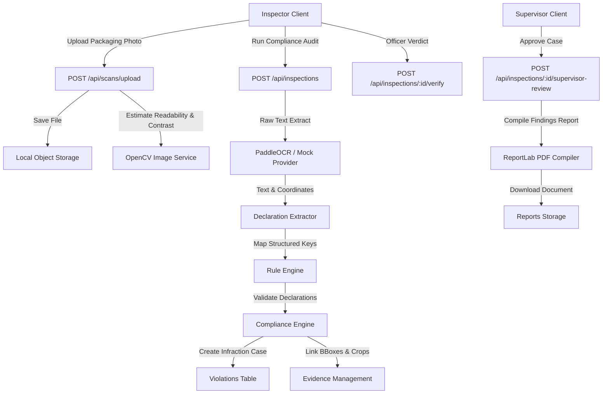

# Legal Metrology Compliance System Backend

Production-ready backend API service for the **Legal Metrology (Packaged Commodities) Compliance System** built with Python 3.12+, FastAPI, SQLAlchemy, PostgreSQL, and OpenCV.

---

## System Architecture



---

## Directory Structures
*   `app/api/`: Endpoint route modules (Auth, Scans, Inspections, Violations, Reports, Rules, Dashboard, Audit Logs).
*   `app/models/`: Database schemas (SQLAlchemy) mapping compliance history.
*   `app/services/`: Image preprocessing, OCR providers, and rules engine.
*   `app/core/`: Security and RBAC permission middleware.
*   `tests/`: Unit testing for engines.

---

## Local Setup & Run

### Prerequisite: Setup Virtual Environment
```bash
python -m venv venv
venv\Scripts\activate
pip install -r requirements.txt
```

### Configure environment
Copy `.env.example` to `.env` and fill database connection details:
```bash
Copy-Item .env.example .env
```

### Seeding Sandbox Database
To seed the database with initial roles, sample rules, and inspections history for Parle-G, Surf Excel, and Haldiram's:
```bash
python -m app.db.seed
```

### Running Backend
```bash
uvicorn app.main:app --reload
```
Swagger UI will be available at **`http://localhost:8000/docs`**.

---

## Running Automated Tests
```bash
pytest -v
```

---

## Docker Compose Setup
To run the complete system (FastAPI app + PostgreSQL database) as container services:
```bash
docker compose up --build
```

---

## Sandbox Demo Credentials
*   **Inspector**: `inspector@example.com` / `Password123` (Employee ID: `LMI-88902`)
*   **Supervisor**: `supervisor@example.com` / `Password123` (Employee ID: `LMS-77102`)
*   **Rule Administrator**: `ruleadmin@example.com` / `Password123` (Employee ID: `LMA-44390`)
*   **Auditor**: `auditor@example.com` / `Password123` (Employee ID: `LMA-99021`)
